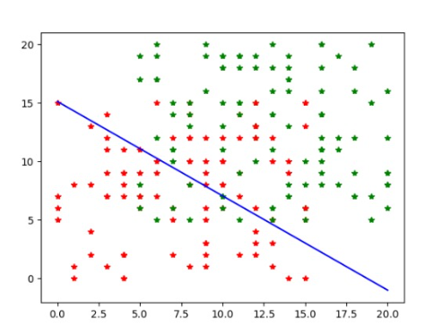
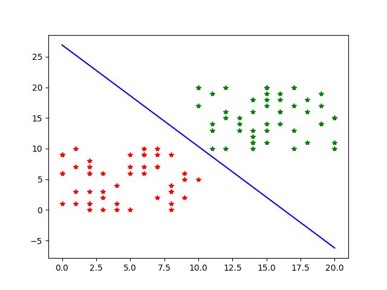
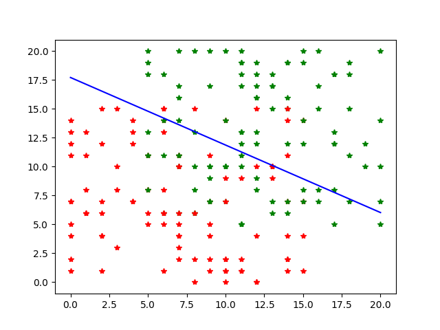
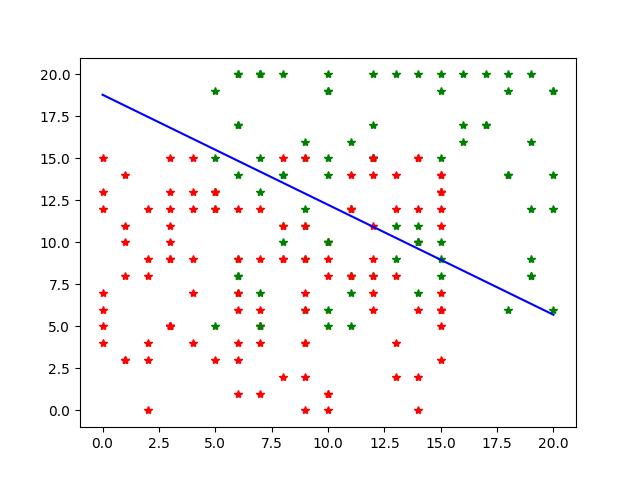
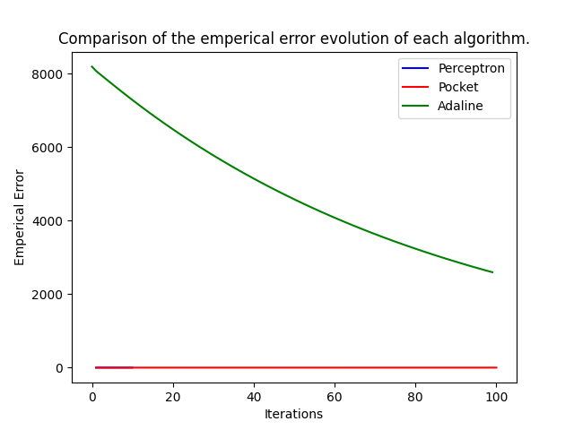
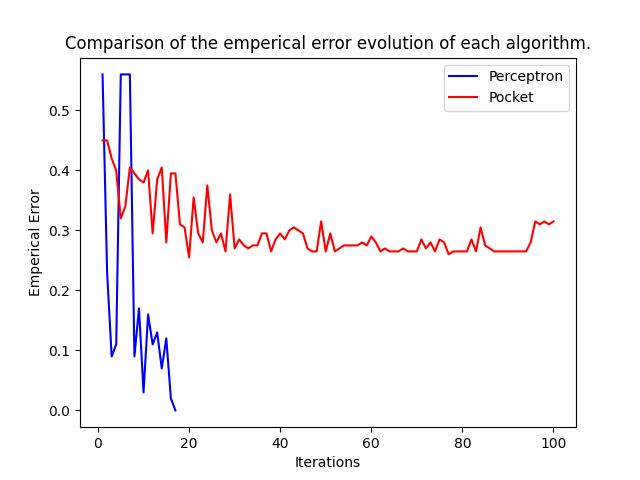

# Machine-Learning LAB1: Classification Algorithms

## Introduction

In this repository, we implemented the basic ML algorithms of binary classification:

- Perceptron Learning Algorithm
- Pocket Learning Algorithm
- Adaline Learning Algorithm (Delta Rule variant)

The ```main.py``` and ```data.py``` files are respectively used to use the methods and to generate either lineary separable and/or unseparable data.

The following markdown is a synthesis of the results of the previous algorithms.

## Plot of a set of randomized data in 2D
The ````data.py``` was used to generate a set of random points in the space labeled $-1$ or $1$. We can configure the distribution of the points in the 2D space in such a way that the dataset is separable or not separable. However, the points of each category are uniformly distributed in a sub rectangle area of the whole plan.



## Plot results of each algorithm on a random dataset

1. PLA with linearly separable randomized data:


2. Pocket with linearly non-separable randomized data ($T_{max} = 100$):
 


3. Adaline (delta rule variant) with linearly non-separable randomized data ($T_{max} = 100$ and $\alpha = 0.0001$):



## Comparing the 3 algorithms:
### Number of iterations
The PLA is the fastest algorithm in matter of number of iterations. Actually, it is the only algorithm that always converges since it works on separable data while the other algorithms generaly don't converge to $0$, but finish by oscillating around a small value $\epsilon \sim 0.1$. Thus, generaly we notice that the number of iterations of the Pocket and Adaline algorithms is the same $T_{max}$ set up in the start configuration.

### Empirical error evolution


The speed of convergence of the Adaline algorithm is the slowest among the 3 algorithms. Also, the value of its empirical error is the biggest among them, with a very big marge of difference. This could be explained by the nature of the loss function in the Adaline case: summing the square of the differences results in a very big value.


The PLA algirthm also has generally a fatser speed of convergence and a more accurate result comparing to the Pocket algorithm as we can see in the previous plot. Furthermore, the Pocket algorithm seems to stop its convergence starting from a certain iteration and enters in a random oscillation character.


### Accuracy
Could be deduced from the empirical error value: it's the complemantary function of the loss function. In other words, the lower is the empirical error, the higher is the accuracy and vice-versa.


## Discussion about $T_{max}$
The learning rate and iterations choice are pretty arbitrary. This is essentially unavoidable in the context of training neural networks with gradient descent methods. Nowadays, there are several “tricks” that can be applied to search for parameters like the learning rate $\alpha$ more efficiently, but the problem of searching for those kinds of parameters persist.

